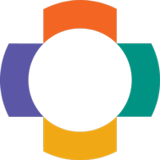

# Welcome to OpenMRS!

   

Thank you for your interest in the OpenMRS Community! We have created this book for people who are curious about becoming a developer using our software. This book serves as a quick guide for you to learn more about our history, what [OpenMRS does,](http://openmrs.org/about/mission/) and understand more about how our community works.

If you find yourself eager to get started, we've also included some practical advice on specific steps you can take right away to start doing development with the OpenMRS platform.

As with much of free and open source software, what you're reading is a **"living" and evolving resource!** This book was initially created over just 3 days during the 2013 [Google Summer of Code](https://summerofcode.withgoogle.com) Doc Sprints held at the Google campus in Mountain View, California, United States.

The event was a partnership between the Google Open Source Programs Office, Aspiration, and FLOSS Manuals. The initial authors of this book represented a wide variety of OpenMRS community members & developers:

* **Michael Downey**  (United States)
* **Eric Holscher** (United States)
* **Suranga Nath Kasthurirathne** (Sri Lanka)
* **Daniel Kayiwa** (Uganda)
* **Jordan Kellerstrass** (United States)
* **Elyse Voegeli** (United States)

Photos used in this book are courtesy of Michael Downey and OpenMRS1, Limited.

We welcome your feedback on this book. We want to know if it helps you get started as an OpenMRS developer, and what might be missing. You can make comments directly in the online version of this book, or send your feedback to community@openmrs.org. We're ready to use your comments and input as we continuously update this resource.

Who should read this book

Several people who care about OpenMRS gathered in 2013 to create this information resource for you. Who are you exactly? As this book's authors, we assume you are a software developer who is new to OpenMRS and someone who wants to learn more about the project and community that is OpenMRS. You're someone who shares our values and believes in our mission to improve health care delivery in resource-constrained environments by coordinating a global community to create and support this software. You're someone who wants to become a member of our community.

Being new to OpenMRS can mean different things for different people:

You might be new to software development.
You might be new to free and open source software projects.
You might be new to health IT.
You might just be new to OpenMRS specifically.
Regardless of what you know or how much you need to know, this book is designed for you!

What you will gain

This book is designed to give you the knowledge, tools, and confidence to be an OpenMRS developer, no matter from which point you're starting. We'll give you a background and brief history of OpenMRS. We'll also talk about where we are now, and how we are working together to change the world.

At the end of this book, you should:

Understand how the OpenMRS community interacts and communicates
Have a development environment setup
Understand the basics of the OpenMRS system
Be able to troubleshoot OpenMRS with resources in the community.
Know where to go to get started with your first contributions to the community.
By the end of this book, you'll be an OpenMRS developer, contributor, and community member!

 

We want to know what you think about this book! After you take a look, fill out our brief survey and let us know what you think: http://go.openmrs.org/newdev-survey 

